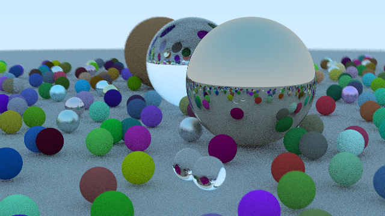

# Ray Tracing in One Weekend in OpenCL



Ray tracing in One Weekend in OpenCL 1.2. Branches roughly follow the chapters of
the infamous [Ray Tracing in One Weekend](https://raytracing.github.io/books/RayTracingInOneWeekend.html) 
by P. Shirley, so it should be fairly easy to follow what's going on.

Some of my design choices might seem weird and I change it quite a bit along the
way. The main problem was using C in OpenCL kernels and C++ in host side.
Using arrays of structs was NOT a good call as I did at the beginning. 
The viable way is to use struct of arrays, to pass values from host to kernel,
then parse those values inside the kernel.

This choice bloated the arguments of the entry point of the kernel and
resulted in use of aggregative objects like `SceneHittable` which regroups all
attributes under one object which in turn can complicate parsing in kernel,
but at least I could not find a better way. Feel free to make suggestions in
issues.

For those who are completely new to OpenCL, there should be couple of examples
in the first few branches that are relatively easy to understand.

I recommend you to finish the book in c++ or another language of
your choice first, before tackling the intricacies of OpenCL. We are at its
base implementing the same algorithms in a different manner, and Shirley does
implement the simplest version of nearly everything, so as a learning
experience Shirley's work is way more efficient.

Most of the process of writing this project is documented along the
streams which can be found here:

- [Ray Tracing In OpenCL](https://www.youtube.com/playlist?list=PLbhIZsELcDlzQfv4w2nyQS-ngWAwF-H__)

## Building

I am using CMake to build the project.
The simplest version of `CMakeLists.txt` should be something like this:
```
cmake_minimum_required(VERSION 3.2 FATAL_ERROR)
project("OpenCL Path Tracer")

set(CMAKE_CXX_STANDARD 11)
set(CMAKE_CXX_STANDARD_REQUIRED ON)
set(CMAKE_EXPORT_COMPILE_COMMANDS ON)

set(CMAKE_CXX_FLAGS "-lstdc++ -ldl -ggdb -Wall -Wextra -pedantic -Wextra-tokens -std=c++11")

find_package(OpenCL REQUIRED)

set ( ALL_LIBS
    ${OpenCL_LIBRARY}
)

include_directories(
    "./include/"
    ${OpenCL_INCLUDE_DIR}
)
link_directories(${OpenCL_LIBRARY})

add_executable(
    oneweekend.out
    "src/oneweekend/main.cpp"
)

target_link_libraries(oneweekend.out ${ALL_LIBS})
install(TARGETS oneweekend.out DESTINATION "${PROJECT_SOURCE_DIR}/bin")
```
Once you have that at your `CMakeLists.txt` you create a `build` directory at
main project directory where you see this file.

- `cd build`
- `cmake ..` or `cmake-gui ..` or `ccmake ..` and set any options you'd like
  for building (compiler choice etc).
- `make install`. The install is necessary, but don't worry it is not
  installing it to you system. You should find the executable in `bin` folder.

The reason for the necessity of the install is that, kernel file is located in
`kernels` folder under `bin` and the program searches the file located under
that directory during runtime

Once you run the `oneweekend.out` it should produce and image under
`media/ppm` named dully as `oneweekend.ppm`.

## Areas of Improvement

- Random handling. I am using [Intel's
  implementation](https://software.intel.com/content/www/us/en/develop/articles/parallel-noise-and-random-functions-for-opencl-kernels.html)
  of `Noise_2D` and send seeds from host. This seems to work fine for small
  images but I am not sure if it is a scalable approach for larger images.

- Object handling. Aggregative structures such as `SceneHittable` requires
  padding of empty attributes which is not ressource friendly.

- Kernel arguments. As the lightening calculations become more complex, it
  becomes difficult to track the order of arguments of the kernel.

- Diffuse lambertian reflection in the image seems a bit off and it changes
  quite a bit as I change random function in its scattering function. Not sure
  why.

